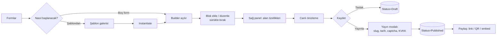
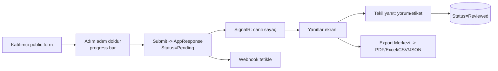
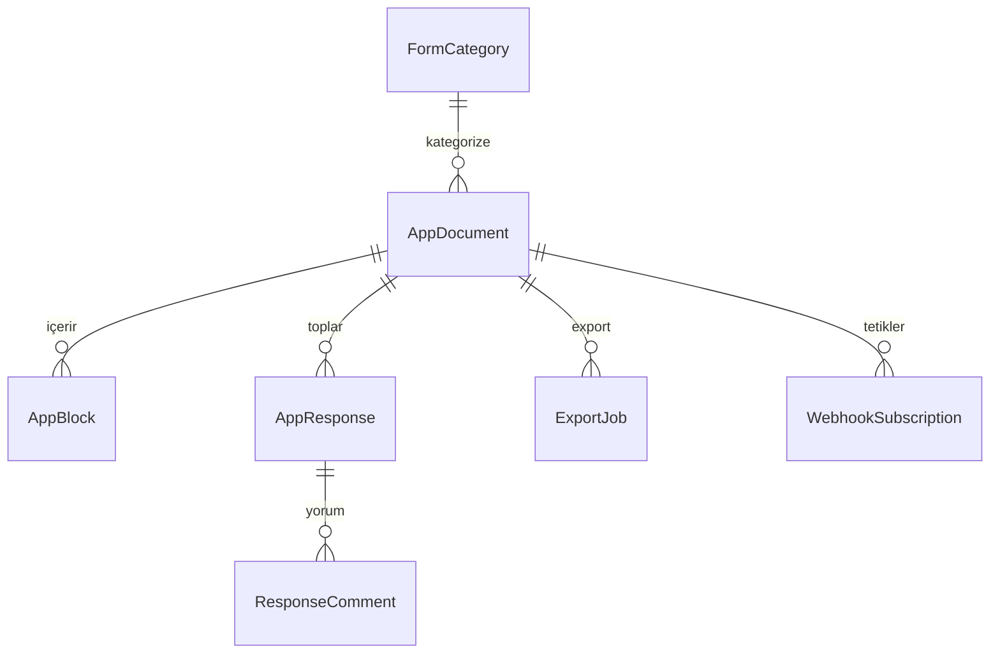

# Apya Form Yönetim Sistemi — Tasarım Dokümanı

> Google Forms + Typeform + Microsoft Forms karışımı, kurumsal SaaS seviyesinde modern Form Yönetim Sistemi.
> Mevcut **DynamicAssets** modülü (`AppDocument` / `AppBlock` / `AppResponse`) üzerine inşa edilir.
> Stack: **ABP 10 + .NET 10 + React 18 + Vite + Tailwind + React Query + SignalR** · Clean Architecture · Atomic Design.

---

## 0. Mevcut Durum & Gap Analizi (en kritik bölüm)

Bu sistem **sıfırdan değil**; mevcut altyapının ürünleştirilmesidir. Ne var, neyi eklemeliyiz:

### 0.1 Mevcut (✅ kullanılacak)
| Katman | Mevcut |
|--------|--------|
| Domain | `AppDocument` (Title, IsTemplate, ParentTemplateId, Slug, Blocks), `AppBlock` (Type, Order, **Content/Settings/AgentContext = JSONB**), `AppResponse` (DocumentId, RespondentId, **Answers = JSONB**) |
| Enum | `BlockType` (8 tip) |
| App Service | `ITemplateAppService`, `IDynamicDocumentAppService`, `IResponseAppService` (anonim submit), `IPublicDocumentAppService`, `IWebhookSubscriptionAppService` |
| Altyapı | Webhook publish/delivery (job + log), multi-tenant, FullAudited |
| Frontend | Vite island mimarisi, **Atomic UI kit** (Button, Card, Input, Sheet, Combobox, DateRangePicker, Badge, Skeleton, EmptyState, Toast, ThemeToggle), `DataTable`, `useDeviceMode` (responsive), `ThemeProvider` (dark mode), React Query (`QueryProvider`/`httpClient`), SignalR realtime, PWA service worker |
| Builder | `template-builder.jsx` — basit (4 tip, yukarı/aşağı taşıma, sağ panel yok) |

### 0.2 Eklenecek / Genişletilecek (❌ eksik)
| # | Gap | Aksiyon |
|---|-----|---------|
| G1 | `BlockType` 8 → **17 tip** | Email, Phone, Time, Rating, Nps, Signature, Address, SectionHeader, Paragraph; `Input` → ShortText, `TextArea` → LongText netleştir |
| G2 | `AppDocument` durum/kategori/tema yok | `Status`, `CategoryId`, `Description`, `ThemeJson`, `PublishSettingsJson`, `ViewCount`, `ResponseCount`, `PublishedAt` |
| G3 | `AppResponse` workflow yok | `Status` (Pending/InReview/Reviewed), `TagsJson`, `CompletionSeconds`, `RespondentMetaJson` (IP/UA), + `ResponseComment` child |
| G4 | **Category** entity yok | Yeni aggregate `FormCategory` (Name, Color, Icon, Order) |
| G5 | Builder yetersiz | Drag&drop, sağ özellik paneli, koşullu görünürlük, canlı önizleme, tema editörü |
| G6 | Yanıt yönetim UI yok | Responses ekranı (grid + tekil + analiz) |
| G7 | Export yok | PDF/Excel/CSV/JSON + toplu + geçmiş (`ExportJob`) |
| G8 | Forma özel Dashboard yok | İstatistik kartları + grafikler |
| G9 | Şablon galerisi yok | Kategorili hazır şablon galerisi + seed |
| G10 | Granül izin yok | `Publish`, `ViewResponses`, `Export`, `ManageCategories` izinleri |

---

## 1. Bilgi Mimarisi (IA)

```
Form Yönetimi (Şablonlar & Formlar)
│
├── Dashboard ............... özet metrikler + grafikler
│
├── Formlar
│   ├── Tüm Formlar ......... kart/liste, filtre (kategori/durum)
│   ├── Form Oluştur ........ tam ekran builder
│   ├── Taslaklar ........... Status=Draft filtresi
│   ├── Yayındakiler ........ Status=Published filtresi
│   └── Arşiv ............... Status=Archived filtresi
│
├── Kategoriler
│   ├── Liste ............... renk/ikon yönetimi
│   └── Yeni Kategori
│
├── Yanıtlar
│   ├── Tüm Yanıtlar ........ tenant geneli yanıt akışı
│   ├── Bekleyenler ......... Status=Pending
│   └── İncelenenler ........ Status=Reviewed
│
├── Şablonlar
│   ├── Hazır Şablonlar ..... galeri (kategori bazlı)
│   └── Şablon Oluştur ...... builder (IsTemplate=true)
│
├── Raporlar
│   ├── Form Analizleri
│   ├── Kullanıcı Analizleri
│   └── Export Merkezi
│
└── Ayarlar ................. varsayılan tema, marka, webhook, KVKK metni
```

**İçerik hiyerarşisi (aggregate):**
`FormCategory 1—N AppDocument 1—N AppBlock` · `AppDocument 1—N AppResponse 1—N ResponseComment` · `AppDocument 1—N ExportJob`

---

## 2. User Flow Diagram

### 2.1 Form oluşturma → yayınlama


### 2.2 Yanıt toplama → inceleme


---

## 3. Sitemap (rota tablosu)

| Rota | Ekran | Erişim |
|------|-------|--------|
| `/forms` | Dashboard | Auth |
| `/forms/list` | Tüm Formlar | Auth |
| `/forms/new` · `/forms/{id}/edit` | Builder (tam ekran) | `DynamicAssets.Create/Edit` |
| `/forms/drafts` · `/forms/published` · `/forms/archive` | Filtreli liste | Auth |
| `/forms/categories` · `/forms/categories/new` | Kategoriler | `ManageCategories` |
| `/forms/responses` · `/responses/pending` · `/responses/reviewed` | Yanıtlar | `ViewResponses` |
| `/forms/{id}/responses` | Forma özel yanıt paneli | `ViewResponses` |
| `/forms/templates` · `/forms/templates/new` | Şablon galeri/builder | Auth / `Create` |
| `/forms/reports/*` · `/forms/exports` | Raporlar / Export | `Export` |
| `/forms/settings` | Ayarlar | `Edit` |
| **`/f/{slug}`** (public, anon) | Yayınlanan form | Public |

---

## 4. Atomic Design Yapısı

Mevcut `components/ui` atom seti korunur, form-spesifik moleküller/organizmalar eklenir.

```
Atoms (mevcut + yeni)
  Button, Input, Textarea, Select, Checkbox, Radio, Badge, Avatar,
  Skeleton, Spinner, Switch, Tooltip, Icon, RatingStar, NpsCell, SignaturePad*

Molecules
  FormField (label+input+help+error), BlockPaletteItem, BlockToolbar,
  StatCard, FilterBar, SearchInput, TagInput, ColorPicker, FileDropzone,
  ProgressBar, KvkkConsent, ShareLinkBox, ChartCard

Organisms
  BlockPalette (sol panel), FormCanvas (orta), PropertyPanel (sağ),
  FormCard / FormTable, ResponseGrid, ResponseDetailPanel, AnalyticsBoard,
  PublishModal, TemplateGallery, CategoryManager, ExportCenter

Templates (sayfa iskeleti)
  BuilderLayout (3 panel), ListLayout, DashboardLayout,
  PublicFormLayout (minimal, dark-mode), SettingsLayout

Pages
  FormsDashboard, FormsList, FormBuilder, ResponsesPage,
  TemplatesPage, ReportsPage, PublicFormPage
```
`*` SignaturePad: hafif bir canvas tabanlı atom.

---

## 5. React Component Tree (Builder örneği)

```
FormBuilderPage
└── BuilderLayout
    ├── BuilderTopBar  (başlık · kaydet · önizle · Yayınla · geri al/ileri)
    ├── BlockPalette                 [organism]
    │   └── BlockPaletteItem × 17    [molecule, draggable]
    ├── FormCanvas                   [organism, droppable]
    │   ├── FormHeader (logo, kapak, başlık, açıklama)
    │   └── SortableBlockList
    │       └── CanvasBlock × N      (BlockToolbar + render-by-type)
    │           └── BlockRenderer ── ShortText|LongText|Number|Email|...
    ├── PropertyPanel                [organism] (seçili bloğa bağlı)
    │   ├── GeneralProps (label, placeholder, help, required, default)
    │   ├── ValidationProps (regex, min/max, mask)
    │   └── VisibilityRules (koşullu: "X cevabı = Y ise göster")
    └── PreviewDrawer (canlı, cihaz seçici: masaüstü/tablet/mobil)
```
Durum yönetimi: builder için tek `useReducer` (form taslağı) + React Query (persist). Drag&drop: `@dnd-kit` (hafif, a11y dostu). Optimistic save mevcut `optimisticList.js` deseniyle.

---

## 6. Sayfa Wireframe Açıklamaları (özet)

- **Dashboard:** Üstte 5 `StatCard` (Toplam/Aktif Form, Bugünkü/Toplam Yanıt, Bekleyen İnceleme). Altında 3 sütun: "Son 7 Gün Yanıt" çizgi grafiği · "En Çok Doldurulan" bar · "Son Oluşturulan/Son Yanıtlar" listeleri.
- **Formlar:** `FilterBar` (kategori chip + durum + arama) → responsive kart grid (mobilde `FormTable`). Kart: ad, kategori rozeti, durum rozeti, tarih, görüntülenme/yanıt sayacı, kebab menü (Düzenle/Kopyala/Yayınla/Paylaş/Yanıtlar/Sil).
- **Builder:** 3 panel (sol palet / orta canvas / sağ özellik). Boş durumda EmptyState. Üst barda otomatik kaydetme rozeti + "Yayınla".
- **PublishModal:** slug (otomatik+düzenlenebilir), yayın URL önizleme, özel domain, şifre, başlangıç/bitiş tarihi, captcha, KVKK & çerez onayı toggle'ları; "Yayınla" → paylaşım ekranı (link kop-yala, QR, embed iframe).
- **Public form (`/f/{slug}`):** Minimal, marka temalı, dark-mode, adım adım + progress bar, mobil öncelikli, captcha & KVKK kapısı.
- **Yanıtlar:** Üstte 4 kart (Toplam, Bugün, Tamamlanma %, Ort. süre). Sekmeler: Tüm Yanıtlar (`DataTable`: filtre/arama/sırala/kolon gizle) · Tekil Yanıt (detay + PDF + yorum + durum + etiket) · Analizler (pasta/bar/trend/heatmap).
- **Export Merkezi:** Format seçimi (PDF/Excel/CSV/JSON), kapsam (form/tarih aralığı), toplu kuyruk, geçmiş tablosu (durum + indir).

---

## 7. Veri Modelleri

### 7.1 BlockType (genişletme)
```csharp
public enum BlockType
{
    // mevcut (geri uyumluluk için değerler korunur)
    ShortText = 0, LongText = 1, Select = 2, MultiSelect = 3,
    DatePicker = 4, FilePicker = 5, TableGrid = 6, RichText = 7,
    // yeni
    Number = 8, Email = 9, Phone = 10, TimePicker = 11,
    Rating = 12, Nps = 13, Signature = 14, Address = 15,
    SectionHeader = 16, Paragraph = 17
}
```
> `Input(0)`→`ShortText`, `TextArea(1)`→`LongText` yalnızca **isim** değişikliği; sayısal değerler sabit kaldığı için mevcut kayıtlar bozulmaz.

### 7.2 AppDocument (yeni alanlar)
```
+ FormStatus Status   (Draft|Published|Archived)   default Draft
+ Guid? CategoryId
+ string? Description
+ string? ThemeJson           (renk, font, logo, kapak)
+ string? PublishSettingsJson (domain, password, start/end, captcha, kvkk, cookie)
+ long ViewCount, long ResponseCount
+ DateTime? PublishedAt
domain metotları: Publish(), Archive(), MoveToDraft(), SetCategory(), IncrementView()
```
`AppBlock` JSONB esnek olduğundan yeni tipler **şema değişikliği gerektirmez** (Settings içinde validation/regex/min-max/options/conditional taşınır).

### 7.3 Yeni entity'ler
```
FormCategory : FullAuditedAggregateRoot, IMultiTenant
  Name, Color, Icon, Order

AppResponse (genişletme)
  + ResponseStatus Status (Pending|InReview|Reviewed)
  + string? TagsJson, int? CompletionSeconds, string? RespondentMetaJson
  + List<ResponseComment>   (Text, CreatorId)  child entity

ExportJob : FullAuditedAggregateRoot, IMultiTenant
  DocumentId?, Format(Pdf|Excel|Csv|Json), Scope, Status, FilePath, RowCount
```

### 7.4 ERD


---

## 8. API Endpoint Tasarımı (ABP auto-API)

| Servis | Metot | Endpoint | İzin |
|--------|-------|----------|------|
| `IFormAppService` (yeni, Document'i genişletir) | GetList/Get/Create/Update/Delete | `/api/app/form` | Create/Edit/Delete |
| | `Publish(id, PublishSettingsDto)` | `POST /api/app/form/{id}/publish` | `Publish` |
| | `Archive(id)` / `Duplicate(id)` | `POST .../archive` · `.../duplicate` | Edit |
| | `GetStatistics(id)` | `GET .../{id}/statistics` | ViewResponses |
| `IFormCategoryAppService` | CRUD | `/api/app/form-category` | ManageCategories |
| `IResponseAppService` | `GetList(formId, filter)` / `Get(id)` | `/api/app/response` | ViewResponses |
| | `SetStatus` / `AddComment` / `SetTags` | `POST .../{id}/...` | ViewResponses |
| | `Submit` (anon, mevcut) | `POST /api/app/response/submit` | Public |
| `IExportAppService` | `Enqueue(ExportRequestDto)` / `GetList` / `Download(id)` | `/api/app/export` | Export |
| `IPublicDocumentAppService` | `GetBySlug` (mevcut) | `GET /api/public/form/{slug}` | Public |
| `IDashboardAppService` | `GetFormDashboard()` | `/api/app/form-dashboard` | Auth |

Public uçlar `[AllowAnonymous]` + rate-limit + captcha doğrulama. Realtime: yeni yanıtta SignalR `FormHub` broadcast (mevcut SignalR altyapısı).

---

## 9. Permission Matrix

Mevcut `Platform.DynamicAssets.*` ağacını genişletiyoruz (yeni "İçerik & Doküman" grubunda):

| İzin | Admin | Editör | Analist | Katılımcı (anon) |
|------|:---:|:---:|:---:|:---:|
| `DynamicAssets` (görüntüle) | ✓ | ✓ | ✓ | – |
| `DynamicAssets.Create` | ✓ | ✓ | – | – |
| `DynamicAssets.Edit` | ✓ | ✓ | – | – |
| `DynamicAssets.Delete` | ✓ | – | – | – |
| `DynamicAssets.Publish` *(yeni)* | ✓ | ✓ | – | – |
| `DynamicAssets.ViewResponses` *(yeni)* | ✓ | ✓ | ✓ | – |
| `DynamicAssets.Export` *(yeni)* | ✓ | ✓ | ✓ | – |
| `DynamicAssets.ManageCategories` *(yeni)* | ✓ | – | – | – |
| Public form doldurma | — | — | — | ✓ |

---

## 10–14. Ekran Tasarım Notları

- **10 Dashboard:** server-side aggregate (`IDashboardAppService`); kartlar `StatCard`, grafikler `ChartCard` (Recharts veya hafif `lib/charts`). SignalR ile "Bugünkü Yanıt" canlı artar.
- **11 Form Builder:** `@dnd-kit` sürükle-bırak; canvas blok aksiyonları (kopyala/gizle/zorunlu/sil); sağ panelde tip-duyarlı özellikler + koşullu görünürlük kuralları (`Settings.visibility`); cihaz seçicili canlı önizleme; otomatik kaydetme (debounce + optimistic).
- **12 Response Management:** `DataTable` (mevcut) + kolon gizleme/filtre; tekil yanıt sheet'i (`Sheet`) içinde PDF üret, yorum, etiket, durum; analizlerde pasta/bar/trend + alan bazlı heatmap.
- **13 Export:** `ExportJob` kuyruğu ABP `BackgroundJob` (mevcut webhook job deseni); PDF (QuestPDF/server render), Excel (mevcut `Dışa Aktar` deseni), CSV/JSON stream; geçmiş + tekrar indirme.
- **14 Mobil:** `useDeviceMode` ile builder mobilde "önizleme + sıralama" moduna düşer (düzenleme masaüstü öncelikli); public form mobil-öncelikli, tek soru/ekran (Typeform tarzı) opsiyonu; PWA offline taslak.

---

## 15. Kurumsal SaaS — Ek Öneriler (eksik gördüklerim)

1. **Versiyonlama & taslak/yayın ayrımı:** Yayındaki forma dokunmadan düzenleme; "yeni sürüm yayınla".
2. **Partial/abandoned responses:** Yarım bırakılan formların kaydı (conversion analizi).
3. **Webhook + Zapier/n8n** (altyapı mevcut) ve **e-posta bildirimi** (yeni yanıtta).
4. **Mantıksal akış (logic jump):** Cevaba göre bölüm atlama — Typeform farkı.
5. **Çoklu dil form:** Form içeriği için tenant dilleri (mevcut localization altyapısı).
6. **Erişilebilirlik & uyum:** WCAG 2.1 AA, KVKK veri saklama süresi & anonimleştirme, audit log.
7. **Anti-spam:** honeypot + rate-limit + captcha; tekrar gönderim engelleme.
8. **Kota & faturalama kancası:** plan başına form/yanıt limiti (mevcut `Feature` sistemi: `Platform:AdvancedReports` gibi).
9. **Şablon paylaşımı:** tenant'lar arası/Marketplace'e açık şablon (ParentTemplateId mevcut).
10. **Embed & QR & kısa link;** **A/B test;** **otomatik PDF makbuz** (sipariş/başvuru formları).
11. **AI entegrasyonu (mevcut Ai modülü):** "konuyu yaz → formu üret", yanıt özetleme, duygu analizi — `AgentContext` alanı zaten bunun için var.

---

## Uygulama Yol Haritası (faz önerisi)

| Faz | Kapsam | Bağımlılık |
|-----|--------|-----------|
| **F1 — Veri & API** | BlockType genişlet, AppDocument/Response alanları, FormCategory, migration, IFormAppService + izinler | — |
| **F2 — Builder** | 3-panel builder, dnd-kit, 17 blok renderer, property panel, önizleme | F1 |
| **F3 — Yayın & Public** | PublishModal, `/f/{slug}` adım-adım form, captcha/KVKK | F1 |
| **F4 — Yanıt Yönetimi** | Responses grid/tekil/analiz, durum/yorum/etiket, SignalR | F1 |
| **F5 — Export & Dashboard** | ExportJob (PDF/Excel/CSV/JSON), forma özel dashboard | F4 |
| **F6 — Cila** | Kategori UI, şablon galerisi+seed, mobil, a11y, i18n | F2-F5 |
```
